# DKO — Digitální kontrola objektů

**Offline-first mobilní systém pro správce nemovitostí a terénní techniky.**

DKO vede celou kontrolu objektu v telefonu — od výběru domu a strukturovaného
seznamu kontrolních bodů přes poznámky a fotodokumentaci až po označení závady,
podpis technika a vytvoření auditovatelného PDF protokolu.

Rozpracovaná kontrola se průběžně ukládá a funguje bez připojení k internetu.
Každá položka může mít vlastní poznámku a více fotografií, do kterých lze
červeně vyznačit konkrétní problém. Uzavřený protokol zůstává neměnný a oprava
vzniká jako nová dohledatelná revize.

### Ověřený provozní stav

Produkční verze DKO byla otestována na skutečném Android zařízení a nasazena
do reálného provozního prostředí. Aplikace je plně funkční pro každodenní
kontroly objektů, práci s fotodokumentací, evidenci závad a tvorbu výsledných
protokolů.

Veřejná ukázka odpovídá zákaznické verzi v53 včetně náhledu celého kompletního
PDF před tiskem, sdílení všech jeho stran, šipky Zpět v Historii a skrytí
vypnutých kontrolních položek z nově vytvořeného PDF.

## ▶ Vyzkoušet DKO

**[🖥️ Otevřít náhled pro PC](https://maxmilianbaron.github.io/DKO/)**

**[📱 Otevřít mobilní náhled 1:1](https://maxmilianbaron.github.io/DKO/?mobile=1)**

[](https://github.com/MaxmilianBaron/DKO/actions/workflows/pages.yml)

Veřejná interaktivní ukázka nevyžaduje instalaci ani přihlášení. Na telefonu se
otevře přes celou obrazovku, na počítači zůstane stejné mobilní rozhraní uvnitř
rámečku telefonu.

**English version:** [jump to the English section](#english)

## Česky

DKO nahrazuje papírovou pochůzku jednotným digitálním procesem. Technik vidí
naplánované objekty, postupuje přes devět tematických sekcí a 48 kontrolních
položek, eviduje stav i závady a na místě vytváří úplnou důkazní stopu.

Výsledkem je dvoustránkový protokol A4 s návaznou fotodokumentací, ve které je
každý snímek jednoznačně propojený s konkrétní kontrolní položkou. Data,
fotografie, PDF a zálohy zůstávají v produkční aplikaci lokálně na zařízení.

### Správa položek a význam rolí

Admin může seznam kontrolních položek průběžně přizpůsobovat provozu — nové
položky přidávat a nepotřebné odebírat. Změny se použijí pro nové kontroly;
rozpracované a uzavřené protokoly si zachovávají původní seznam a auditní stopu.
Ve stejné Admin části lze přidávat a upravovat domy i účty techniků. Odebrání
domu nebo technika vyžaduje opětovné zadání hesla Admina; záznam se skryje z
aktivního seznamu, ale související historie, uzavřené protokoly a PDF se nemažou.

Role `Technik` a `Admin` dnes zpravidla představují jednoho člověka ve dvou
pracovních režimech. DKO je offline aplikace určená pro samostatný provoz na
jednom mobilním telefonu, takže technik provádí kontroly a stejný uživatel podle
potřeby spravuje lokální nastavení. Oddělení rolí je připravené zejména pro
případné budoucí serverové nebo cloudové nasazení s více uživateli a centrální
správou.

Cílem DKO je digitalizovat správu a kontroly budov od pochůzky až po
dohledatelný PDF výsledek, který lze archivovat, sdílet a vytisknout.

Tento repozitář obsahuje bezpečnou interaktivní produktovou ukázku se
smyšlenými daty a veřejně licencovanými ilustračními fotografiemi, nikoli
zákaznickou dokumentaci ani produkční data.

### Lokální náhled

```powershell
py -m http.server 4174 --bind 127.0.0.1
```

Potom otevřít:

```text
http://127.0.0.1:4174/
```

### Náhledy

<table>
  <tr>
    <td><strong>Přihlášení technika nebo Admina</strong><br>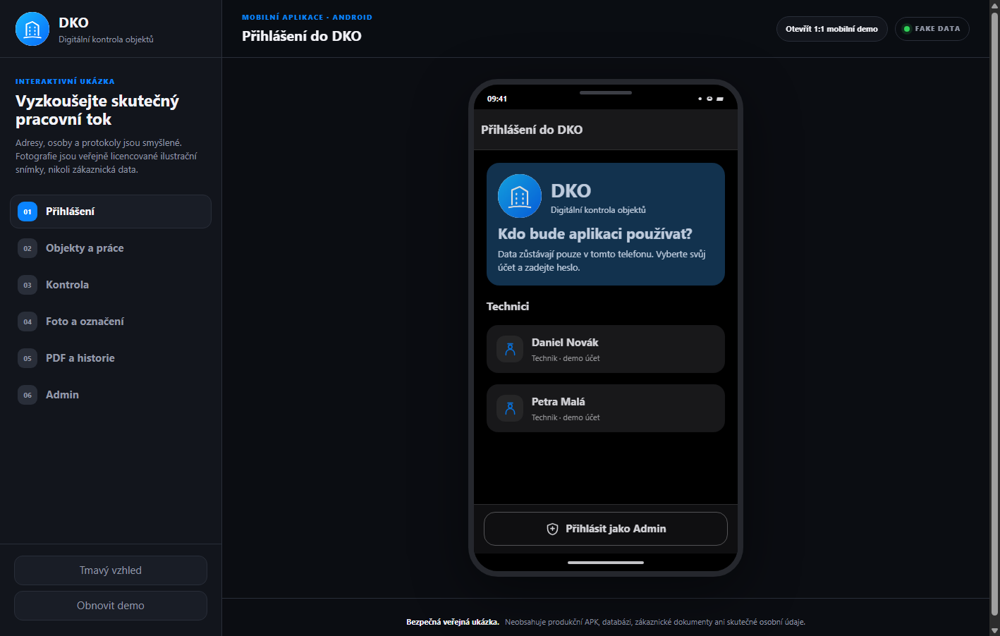</td>
    <td><strong>Objekty a rozpracovaná kontrola</strong><br>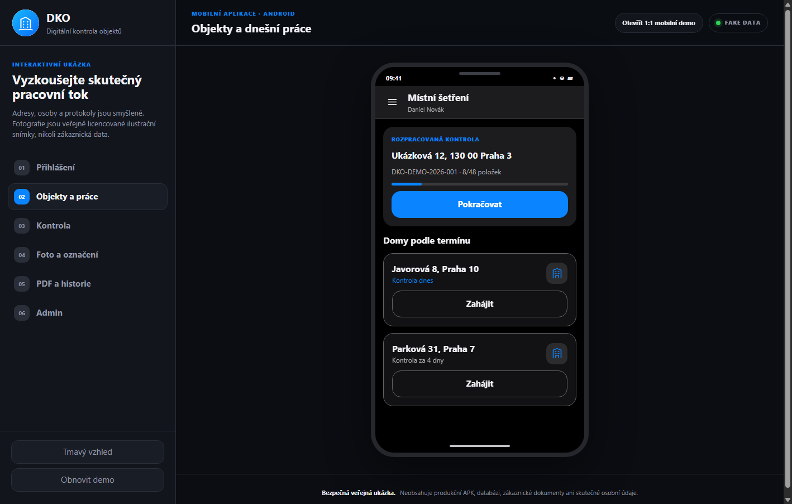</td>
  </tr>
  <tr>
    <td><strong>Přehled kontrolních sekcí</strong><br>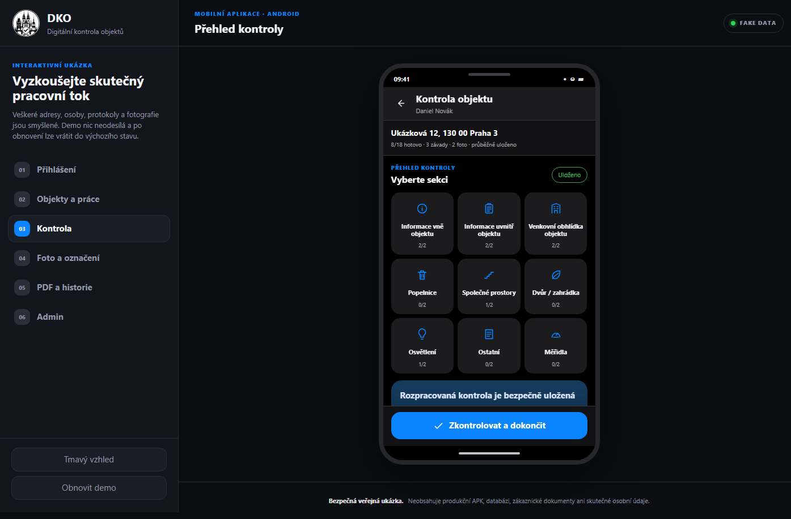</td>
    <td><strong>Fotografie a červené označení závady</strong><br>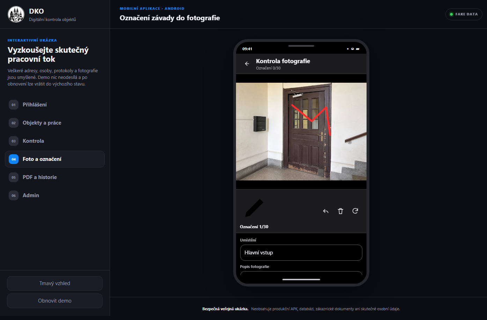</td>
  </tr>
  <tr>
    <td><strong>Fotografie F001–F048 přímo u každé položky</strong><br>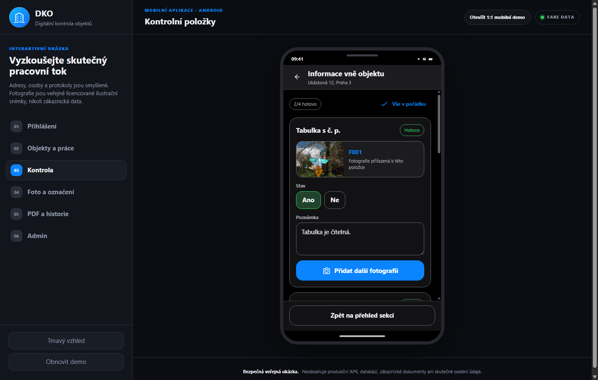</td>
    <td><strong>48 reálných ilustračních fotografií</strong><br>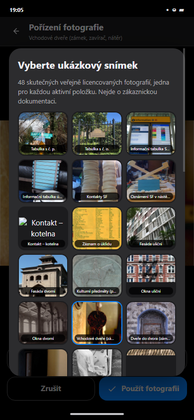</td>
  </tr>
  <tr>
    <td><strong>Historie a auditovatelné dokumenty</strong><br>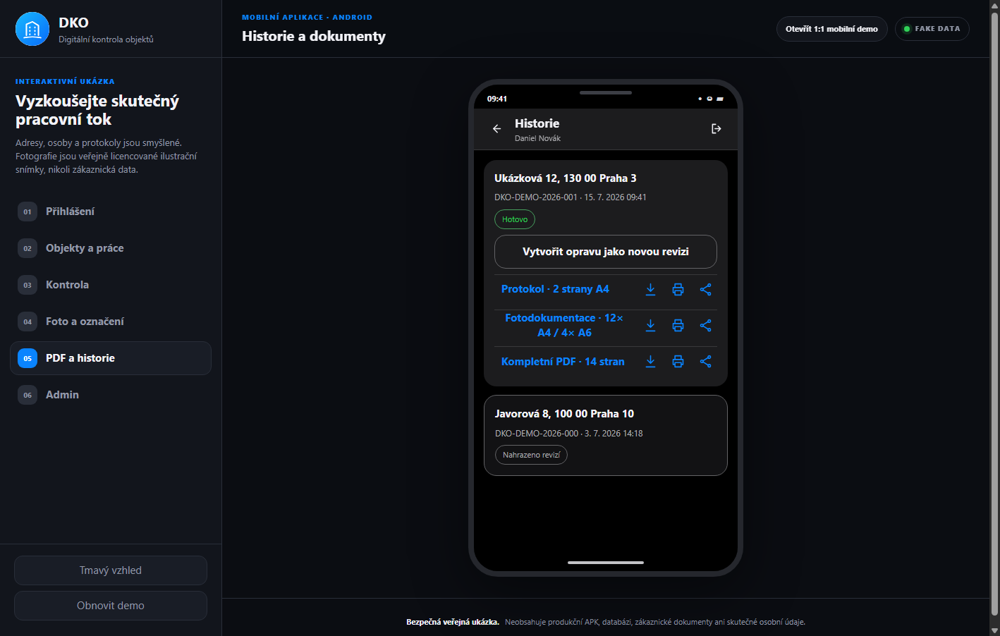</td>
    <td><strong>První A4 protokolu – 28 položek</strong><br>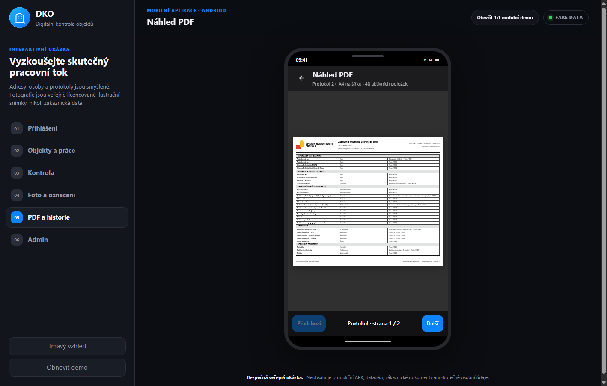</td>
  </tr>
  <tr>
    <td><strong>Druhá A4 protokolu – 20 položek</strong><br>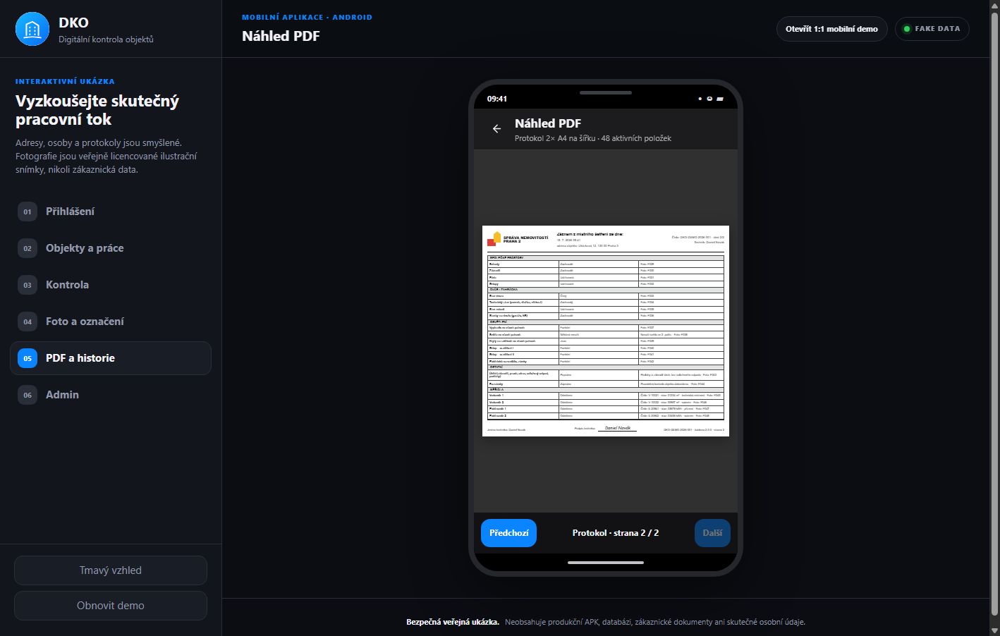</td>
    <td><strong>Fotodokumentace 4× A6</strong><br>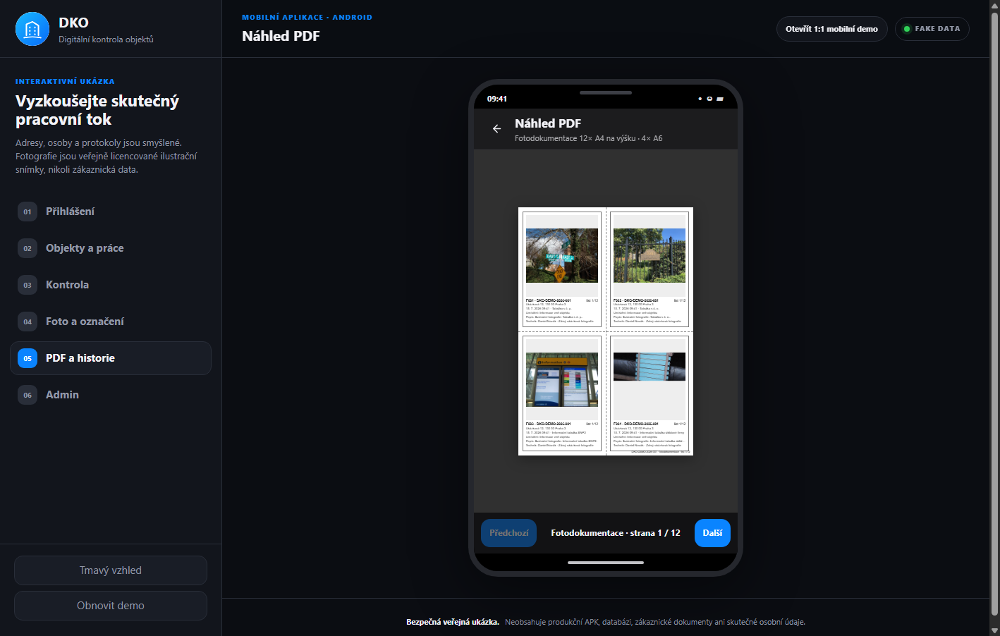</td>
  </tr>
  <tr>
    <td><strong>Kompletní PDF v jednom náhledu před tiskem</strong><br>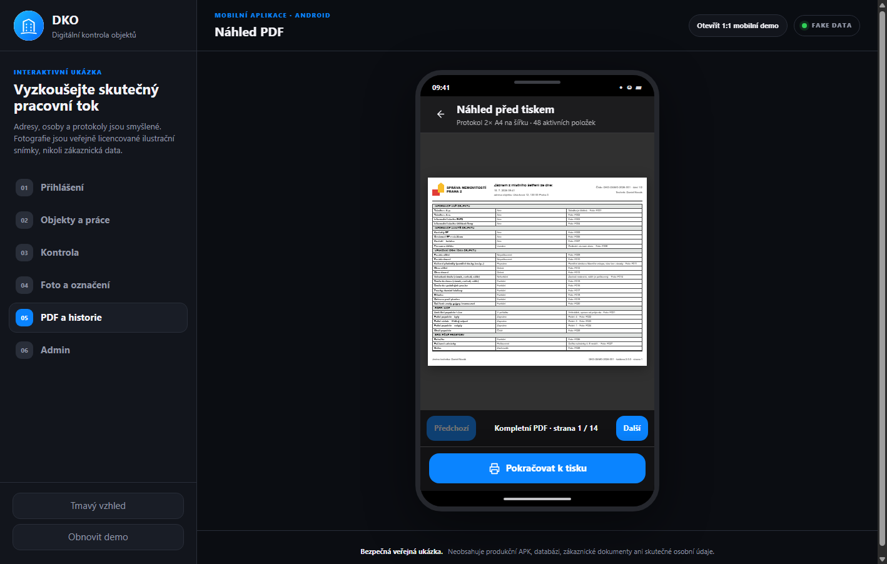</td>
    <td></td>
  </tr>
  <tr>
    <td><strong>Lokální Admin nastavení</strong><br>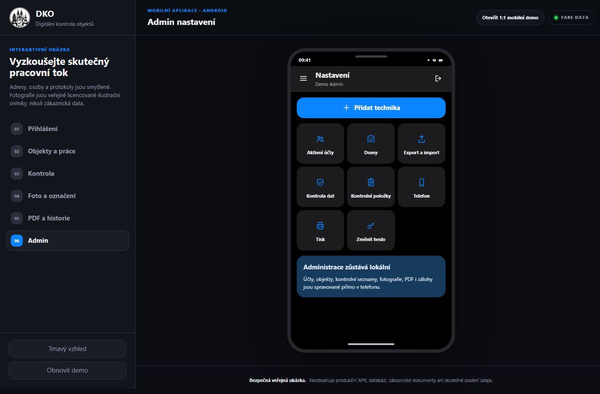</td>
    <td><strong>Admin správa kontrolních položek</strong><br>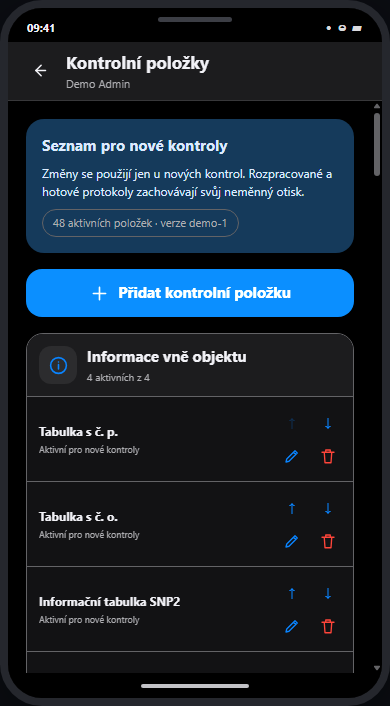</td>
  </tr>
  <tr>
    <td><strong>Admin správa domů</strong><br>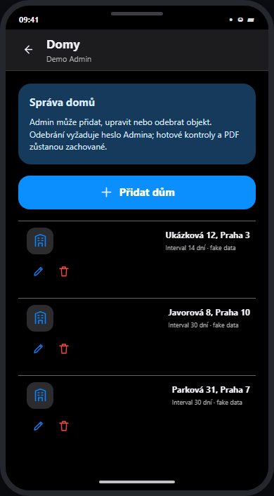</td>
    <td><strong>Účty techniků a potvrzení heslem Admina</strong><br>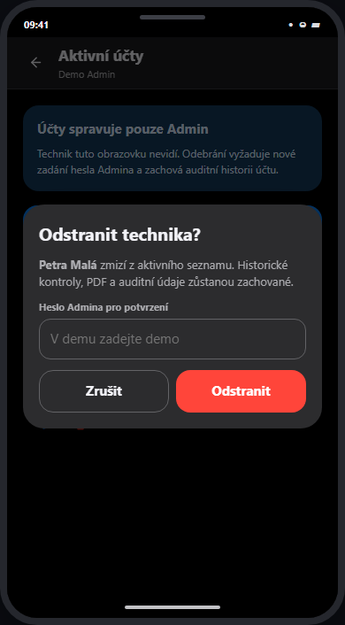</td>
  </tr>
  <tr>
    <td><strong>Mobilní fotografický editor</strong><br>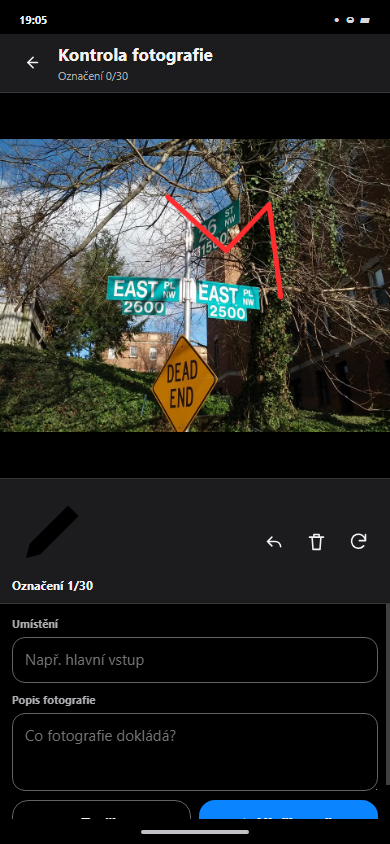</td>
    <td><strong>Mobilní zobrazení aplikace 1:1</strong><br>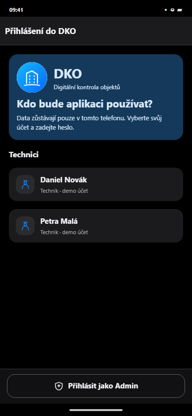</td>
  </tr>
</table>

### Co lze v demu vyzkoušet

- přihlášení do role `Technik` nebo `Admin` s ukázkovým heslem `demo`
- pokračování rozpracované kontroly a výběr objektu podle termínu
- přehled devíti sekcí a všech 48 aktivních kontrolních položek podle skutečné šablony
- stavy v pořádku / závada, samostatné poznámky a fotografie
- hromadné označení dosud nevyplněných položek v sekci
- vlastní skutečná ilustrační fotografie F001–F048 viditelná přímo u každé ze 48 kontrolních položek
- výběr libovolného z 48 snímků v editoru fotografie
- kreslení červeného označení do fotografie, krok zpět a vymazání
- uložení označené pracovní kopie a zachování výchozího snímku
- upozornění na nehotové položky, elektronický podpis a dokončení
- historii, vytvoření opravy jako nové revize a náhled dokumentů
- přesné dvě A4 protokolu na šířku se všemi 48 položkami (28 + 20)
- dvanáct A4 fotolistů na výšku, každý se čtyřmi samostatnými oblastmi A6
- samostatný Protokol, Fotodokumentaci a kompletní 14stránkový dokument
- tisk kompletního PDF přes jeden společný náhled bez výběru protokolu nebo fotolistu
- sdílení celého kompletního dokumentu a skrytí vypnutých položek v novém PDF
- funkční Admin správu domů a účtů techniků: přidání, úpravu a odebrání potvrzené heslem `demo`
- ochranu rolí: správu domů a účtů vidí pouze Admin, nikoli přihlášený technik
- zachování historie, hotových protokolů a PDF při odebrání domu nebo technika
- skutečnou lokální správu seznamu pro nové kontroly: přidání, přejmenování, změnu pořadí, odebrání a obnovení položky
- světlý i tmavý vzhled odpovídající systémovému motivu Androidu
- mobilní zobrazení přes celou obrazovku a možnost instalace jako webové aplikace

### Vztah dema k produkční aplikaci

Vzhled, názvy obrazovek a hlavní pracovní tok vycházejí ze skutečné Android
aplikace DKO. Toto demo je však samostatná statická implementace v HTML, CSS a
JavaScriptu. Nejde o APK ani o zdrojový kód produkční aplikace.

Skutečná aplikace používá Kotlin, Jetpack Compose, Room/SQLite a CameraX. Data,
fotografie, PDF a šifrované zálohy zůstávají lokálně v telefonu. Produkční role,
hesla, integrita souborů a auditní pravidla jsou vynucované nativní aplikací.

### Demo data a fotografie

Veškeré osoby, adresy, čísla protokolů, odpovědi, podpisy a dokumenty jsou
smyšlené. Všech 48 skutečných ilustračních fotografií pochází z veřejných zdrojů
s licencí CC0, CC BY nebo CC BY-SA a nepochází z žádné zákaznické kontroly. Autoři, původní odkazy a
provedené úpravy jsou uvedené v [docs/demo-assets.md](docs/demo-assets.md).

Rychlá navigace v levém panelu slouží pouze pro prezentaci. Při běžném průchodu
lze stejnými obrazovkami projít přímo uvnitř telefonu.

### Hranice repozitáře

Toto demo záměrně neobsahuje:

- produkční Android zdrojový kód nebo APK
- signing klíče, certifikáty, hesla, PINy nebo servisní reset
- databáze, zálohy, logy, MCP nebo interní testovací artefakty
- skutečné zákaznické adresy, kontakty, fotografie, podpisy nebo PDF
- původní zákaznické formuláře a neveřejné nasazovací materiály

Podrobná hranice je v [docs/demo-boundary.md](docs/demo-boundary.md).

### Ověření

Při spuštěném lokálním serveru:

```powershell
node --check app.js
node scripts/verify-demo.mjs
node scripts/capture-screenshots.mjs
```

Automatizovaný scénář ověřuje technický průchod, kreslení do fotografie,
podpis, přesné pokrytí 48 položek na dvou stranách PDF, všechny fotolisty,
Admin část, obrázky a horizontální přetečení stránky.

Všechna práva vyhrazena Aardvarkland Inc.

## English

DKO is an offline-first mobile inspection system for property managers and
field technicians. It guides the complete building-inspection workflow on an
Android phone: scheduled properties, structured checklist items, notes,
multiple photos, red defect markup, technician signature, auditable revisions,
and printable PDF reports.

In-progress inspections are saved continuously and remain available without an
internet connection. Completed reports are immutable; any correction creates a
new traceable revision instead of rewriting the signed result.

### Checklist management and the purpose of roles

The Admin can adapt the checklist to operational needs by adding new items and
removing items that are no longer required. Changes apply to new inspections;
in-progress and completed reports retain their original checklist and audit
trail.

Today, the `Technician` and `Admin` roles usually represent one person working
in two modes. DKO is an offline application designed for independent use on a
single mobile phone, so the technician performs inspections and the same user
manages local settings when needed. The role separation primarily prepares the
product for a possible future server or cloud deployment with multiple users
and central administration.

DKO's goal is to digitise building management and inspections from the on-site
walkthrough to a traceable PDF result that can be archived, shared, and printed.

### Verified production status

The production version of DKO has been tested on a physical Android device and
deployed in a real operational environment. It is fully functional for daily
building inspections, photo documentation, defect tracking, and final report
generation.

The public showcase reflects customer release v51, including the new blue DKO
icon and password-confirmed Admin management of buildings and technicians.

### ▶ Try DKO

**[🖥️ Open the desktop preview](https://maxmilianbaron.github.io/DKO/)**

**[📱 Open the 1:1 mobile preview](https://maxmilianbaron.github.io/DKO/?mobile=1)**

The public interactive product preview requires no installation or sign-in. It
fills the screen on a phone and presents the same mobile interface inside a
phone frame on desktop. It uses fictional data and openly licensed
illustrative photographs, not customer evidence or production data.

### Local preview

```powershell
py -m http.server 4174 --bind 127.0.0.1
```

Then open `http://127.0.0.1:4174/`.

### What the demo supports

- Technician and Admin workflow selection using fictional demo credentials
- due buildings and a recoverable in-progress inspection
- nine inspection sections and all 48 active checklist items from the real template
- good/defect answers, item notes, and multiple photos
- one real, publicly licensed F001–F048 photo shown directly on every one of the 48 item cards
- real pointer or touch drawing with red defect markup
- undo, clear, rotate, description, and saving a marked working copy
- incomplete-item warning, electronic signature, and completion
- history, auditable revision creation, and document previews
- two landscape A4 protocol pages containing all 48 items (28 + 20)
- twelve portrait A4 photo sheets with four separate A6 cards each
- separate protocol, photo-documentation, and complete 14-page previews
- functional Admin management of buildings and technician accounts, including add, edit, and password-confirmed removal
- Admin-only access to account and building management; Technician users do not see these controls
- preserved inspection history and completed PDFs when an account or building is removed from active lists
- functional checklist management for new inspections: add, rename, reorder, remove, and restore an item
- light and dark presentation matching Android system themes

### Production relationship

The visual language, screen names, and main journey are based on the real DKO
Android application. This repository contains a separate static HTML/CSS/JS
showcase, not the production APK or production source tree.

The native product uses Kotlin, Jetpack Compose, Room/SQLite, and CameraX. Its
data, photos, PDFs, and encrypted backups remain local to the Android device.

### Safe demo boundary

All people, addresses, protocol identifiers, answers, signatures, and documents
are fictional. The 48 real illustrative photos come from public CC0, CC BY, or CC BY-SA sources,
not customer work. Full credits and transformations are documented in
[docs/demo-assets.md](docs/demo-assets.md).

This repository intentionally excludes production code, APKs, credentials,
signing material, databases, backups, customer data, customer photos, and
private deployment evidence.

All rights reserved by Aardvarkland Inc.
